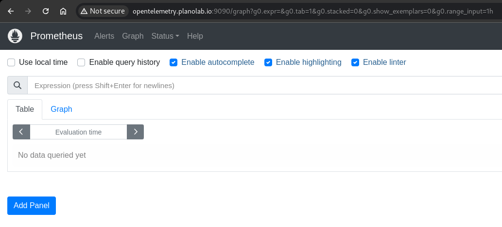

To install Prometheus on Fedora 38, follow these steps:

Make sure your system is up to date. Open a terminal and run:

```bash
ssh student@opentelemetry.planolab.io

sudo setenforce 0

sudo su -
systemctl disable --now firewalld
sudo dnf update -y
```

Create a Prometheus user to run the service as a non-root user:

```bash
sudo useradd --no-create-home --shell /bin/false prometheus
```

Download the latest version of Prometheus from the official site. Check the latest version on the [Prometheus releases page](https://github.com/prometheus/prometheus/releases).

```bash
cd /tmp
curl -LO https://github.com/prometheus/prometheus/releases/download/v2.44.0/prometheus-2.44.0.linux-amd64.tar.gz
```

Extract the downloaded tarball:

```bash
tar -xvf prometheus-2.44.0.linux-amd64.tar.gz
```

Move the Prometheus and promtool binaries to `/usr/local/bin`:

```bash
sudo mv prometheus-2.44.0.linux-amd64/prometheus /usr/local/bin/
sudo mv prometheus-2.44.0.linux-amd64/promtool /usr/local/bin/
```

Create directories for Prometheus configuration and data, then move the configuration files:

```bash
sudo mkdir /etc/prometheus
sudo mkdir /var/lib/prometheus
sudo mv prometheus-2.44.0.linux-amd64/consoles /etc/prometheus
sudo mv prometheus-2.44.0.linux-amd64/console_libraries /etc/prometheus
sudo mv prometheus-2.44.0.linux-amd64/prometheus.yml /etc/prometheus
```

Set the appropriate ownership for the Prometheus files and directories:

```bash
sudo chown -R prometheus:prometheus /etc/prometheus
sudo chown -R prometheus:prometheus /var/lib/prometheus
sudo chown prometheus:prometheus /usr/local/bin/prometheus
sudo chown prometheus:prometheus /usr/local/bin/promtool
```

Create a systemd service file for Prometheus:

```bash
sudo nano /etc/systemd/system/prometheus.service
```

Add the following content to the file:

```ini
[Unit]
Description=Prometheus
Wants=network-online.target
After=network-online.target

[Service]
User=prometheus
Group=prometheus
Type=simple
ExecStart=/usr/local/bin/prometheus \
  --config.file /etc/prometheus/prometheus.yml \
  --storage.tsdb.path /var/lib/prometheus/ \
  --web.console.templates=/etc/prometheus/consoles \
  --web.console.libraries=/etc/prometheus/console_libraries

[Install]
WantedBy=multi-user.target
```

Reload the systemd daemon to apply the new service and start Prometheus:

```bash
sudo systemctl daemon-reload
sudo systemctl start prometheus
sudo systemctl enable prometheus
```

Finally, check the status of Prometheus to ensure it’s running correctly:

```bash
sudo systemctl status prometheus
```

Prometheus should now be running and accessible. Open your web browser and navigate to `http://<your_server_ip>:9090`.

Testing

```bash

http://opentelemetry.planolab.io:9090

```



