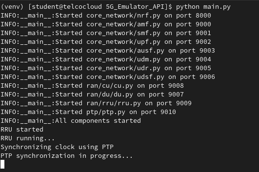
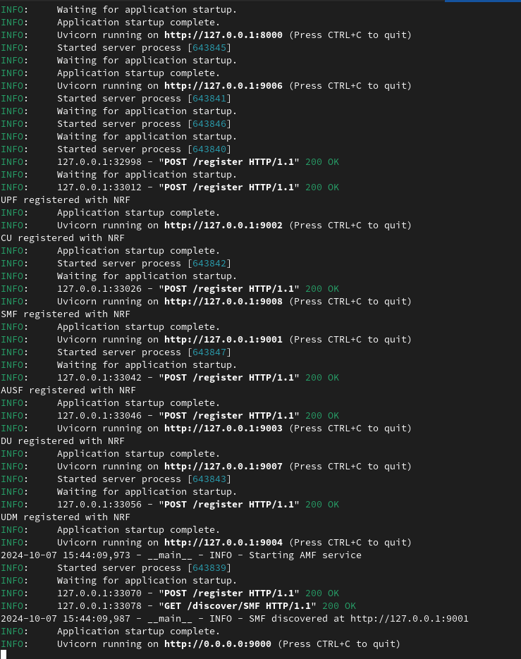

# Open Digital Platform 2.0

Open Digital Platform 2.0 provides a 5G network emulator, simulating both the core network and RAN components for testing and development. It includes network function (NF) scripts, testing utilities, and data for various experiments.

## Table of Contents
- [Project Overview](#project-overview)
- [Project Structure](#project-structure)
- [Installation](#installation)
- [Components](#components)
  - [Core Network](#core-network)
  - [RAN](#ran)
  - [PTP](#ptp)
- [Running the Platform](#running-the-platform)
- [Testing](#testing)
- [Logs and Telemetry](#logs-and-telemetry)
- [License](#license)

## Project Overview

This platform includes the following major functionalities:
- **5G Core Network Emulation**: A variety of 5G core components such as AMF, NRF, SMF, UPF, and others are implemented to simulate network behavior.
- **5G RAN Simulation**: Central Unit (CU), Distributed Unit (DU), and Remote Radio Unit (RRU) components are provided for a complete RAN simulation.
- **Testing Framework**: Testing scripts for verifying interactions between 5G core and RAN components, including utilities for measuring performance and handling anomalies.
- **Telemetry and Monitoring**: Tools for logging and visualizing system metrics and network telemetry.

## Project Structure

```bash
open-digital-platform-2_0
├── 5G_Emulator_API
│   ├── core_network
│   ├── logs
│   ├── ptp
│   └── ran
├── 5G-Core-Stub-docs
├── Dashboard
├── OpenTelemetry_Data
├── venv
├── main.py
├── project_overview_phase_1.md
├── README.md
├── requirements.txt
├── source-code.txt
├── test_5g_network.py
├── test_cu_du.py
├── test_instructions.md
├── LLM-dump.py
├── Instructions-LLM-dump.md
└── udr.db
```

- **5G_Emulator_API**: Contains the core components for simulating the 5G network, including Core Network functions, RAN components, and PTP synchronization.
- **5G-Core-Stub-docs**: Documentation related to the core stubs.
- **Dashboard**: Tools for monitoring the system's real-time performance.
- **OpenTelemetry_Data**: Data generated for and by the telemetry system.
- **test_5g_network.py** and **test_cu_du.py**: Scripts for testing various components of the 5G emulator.
- **udr.db**: A database file used by the Unified Data Repository (UDR).
- **Logs**: Contains log files generated during operation.
  
## Installation

1. **Clone the repository**:
   ```bash
   git clone https://github.com/drcoopertbbt/open-digital-platform-2_0.git
   cd open-digital-platform-2_0
   ```

2. **Install dependencies**:
   Make sure to have Python installed and use the virtual environment if needed:
   ```bash
   pip install -r requirements.txt
   ```

## Components

### Core Network

The **core_network** folder contains the key network functions that make up the 5G core:
- **amf.py**: Access and Mobility Management Function.
- **nrf.py**: Network Repository Function for managing network services.
- **smf.py**: Session Management Function for handling session establishment and management.
- **upf.py**: User Plane Function, for forwarding user traffic.
- **ausf.py**: Authentication Server Function.
- **udm.py**, **udr.py**, **udsf.py**: Various data and subscription management functions.

### RAN

The **ran** folder simulates the Radio Access Network:
- **cu**: Contains the Central Unit (CU) code, handling higher-layer protocols.
- **du**: Contains the Distributed Unit (DU) code, managing real-time layer operations.
- **rru**: Contains the Remote Radio Unit (RRU) code for radio transmission.

### PTP

The **ptp** folder contains the simulation of the Precision Time Protocol (PTP) for network synchronization.

## Running the Platform

To start the 5G network emulator, execute the `main.py` script which manages and starts all core network and RAN components:

```bash
python main.py
```

This will launch the necessary services, including:
- **Core Network**: NRF, AMF, SMF, UPF, AUSF, UDM, UDR, UDSF.
- **RAN**: Central Unit (CU), Distributed Unit (DU), and Remote Radio Unit (RRU).
- **PTP**: Precision Time Protocol.

## Testing

There are two main testing scripts:
- **test_5g_network.py**: Tests for the 5G core and RAN components interaction.
- **test_cu_du.py**: Dedicated tests for the CU and DU interaction within the RAN.

For detailed instructions, refer to the **test_instructions.md**.

## Logs and Telemetry

Logs for all network operations are saved in the **logs** directory. Additionally, telemetry data is collected under **OpenTelemetry_Data**, providing insight into network performance and metrics.


### Example Screenshots






### AMF UE Context Example

Initial UE Context Setup.

```bash

curl -X POST http://localhost:9000/amf/ue/ue001 -H "Content-Type: application/json" -d '{"initial_gnb_id": "gnb001"}'

{"message":"UE context created"}

```

Quick Peek at Context

```bash
curl -X GET http://localhost:9000/amf/ue/ue001

```

Request or "trigger" Handover from UE

```bash

curl -X POST http://localhost:9000/amf/handover -H "Content-Type: application/json" -d '{"ue_id": "ue001", "source_gnb_id": "gnb001"}'

{"message":"Handover process completed","duration":0.09120726585388184}

```

ngap_handover_request_ack

- in the terminal (jaeger agent, collector, and query would persist data)

```bash
curl -X POST http://localhost:9000/amf/handover -H "Content-Type: application/json" -d '{"ue_id": "ue001", "source_gnb_id": "gnb001"}'

{"message":"Handover process completed","duration":0.09120726585388184}
```

Peek at New Context

```bash

curl -X GET http://localhost:9000/amf/ue/ue001

```